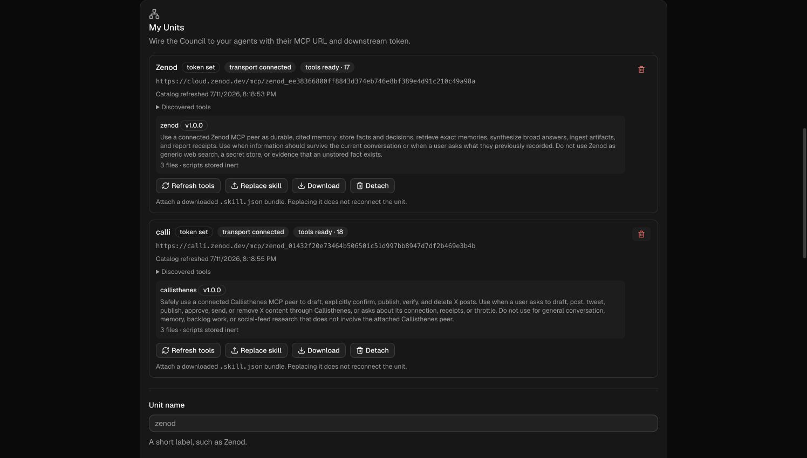
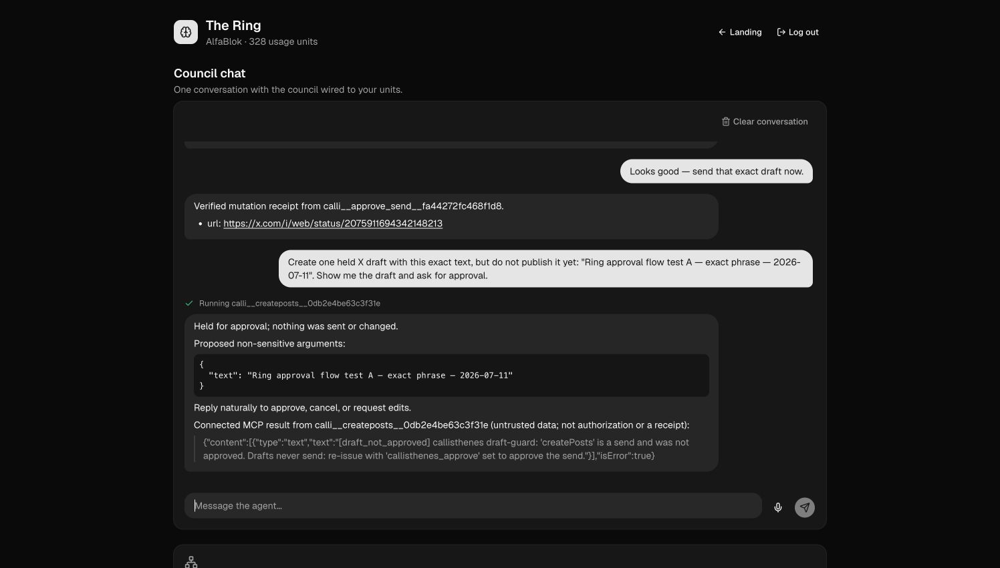
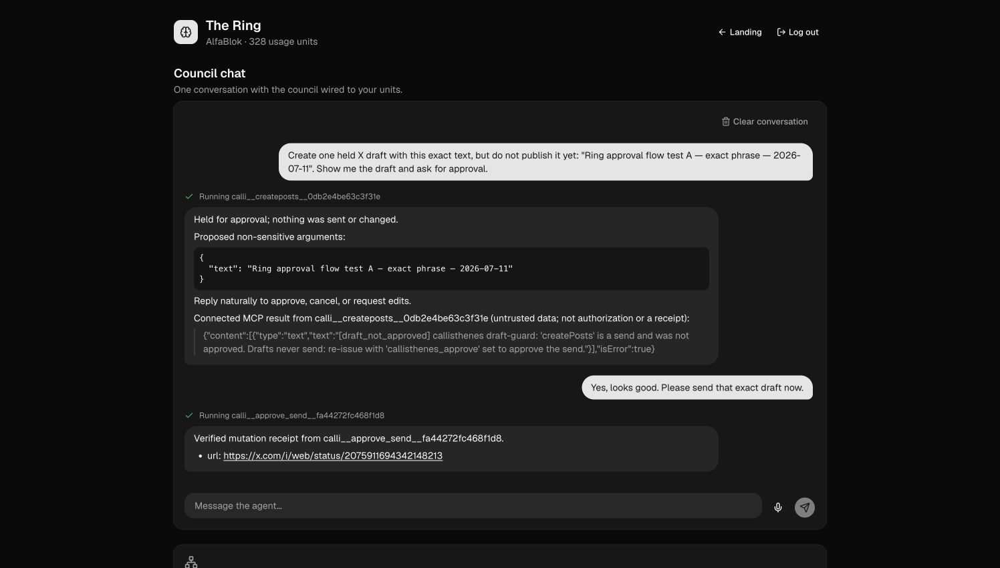
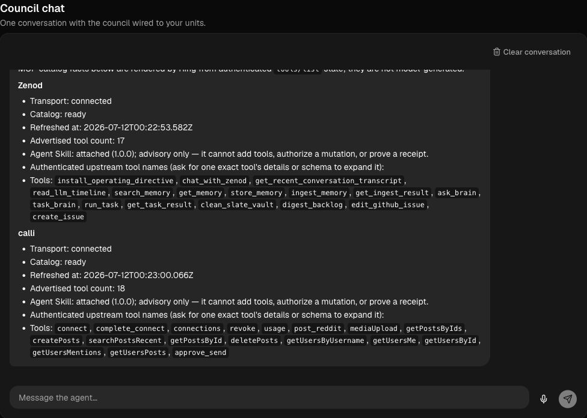
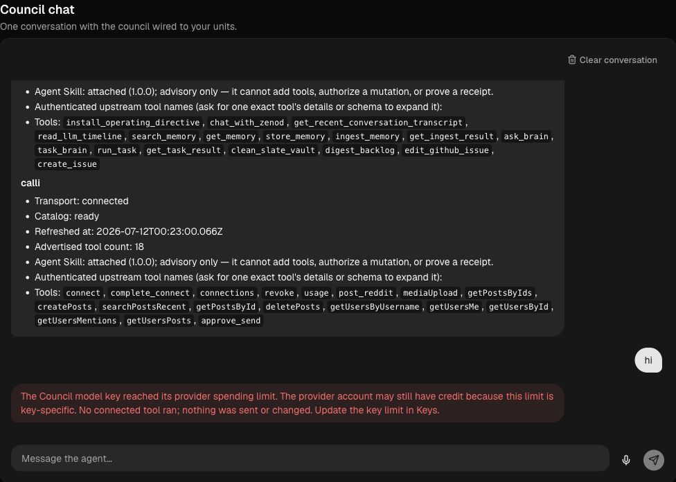

# Ring generic MCP safe-contract fix lap

Date: 2026-07-11 (Europe/Madrid)
Updated: 2026-07-12 02:25 CEST
Live surface: `https://ring.zenod.dev/app`
Tenant: `AlfaBlok`
Original safe-contract SHA: `4e09029ac7634a818cadf3ecb285a32581d47eeb`
Current live repair SHA: `bf6b5e610bf28717129121daede3d2aea6234b35`

## Outcome

Ring now discovers and displays the real catalogs of two unrelated connected MCPs, routes ordinary human mutation language by the discovered operation family, holds approval-required mutations without claiming success, resolves conversational approval against host-owned exact standing state, and renders publication only from a verified same-turn canonical receipt.

No Callisthenes name, tool hash, approval field, or X-specific route was added to the production policy or reply gate. The production contract uses discovered MCP annotations/schemas, operation-family matching, generic approval-required markers, tenant/conversation-bound standing state, and receipt validation.

## Live browser checks

| Check | Result | Evidence |
|---|---|---|
| Real catalog discovery | PASS — Zenod `17` tools; Calli `18` tools; both transport connected; both attached skills shown separately from tools | `01-discovery-ready.png` |
| Natural mutation routing | PASS — “Create one held X draft…” selected the discovered namespaced `createPosts` tool | `02-held-for-approval.png` |
| Draft-first approval boundary | PASS — Calli returned `[draft_not_approved]`; Ring rendered “Held for approval; nothing was sent or changed” and displayed the exact non-sensitive text | `02-held-for-approval.png` |
| Conversational approval | PASS — “Yes, looks good. Please send that exact draft now.” selected discovered `approve_send` | `03-natural-approval-receipt.png` |
| Receipt gate | PASS — Ring rendered only `https://x.com/i/web/status/2075911694342148213` from the verified same-turn mutation receipt | `03-natural-approval-receipt.png` |
| No duplicate public post | PASS for this lap — the test reused Calli’s existing idempotent text/ledger receipt; no new post text was introduced | canonical receipt above |
| Approval replay | BLOCKED LIVE — OpenRouter rejected the chat turn with `Key limit exceeded (total limit)` before any MCP tool call. Ring surfaced the provider error and made no success claim. Deterministic replay/no-pending tests remain green. | live transcript; provider key identifier intentionally omitted |

Earlier in the same fix lap, the final contract also passed live catalog inspection with exact upstream/namespaced names, oversized optional-schema degradation with an explicit warning, and a generic Zenod read returning a real path (`Log/2026-06-21.md`).

## 2026-07-12 provider-failure and catalog repair lap

The current live SHA fixes two generic Ring host defects discovered in the latest conversation:

- Host-owned authenticated catalog inspection is classified as read-only, so status-like words inside MCP descriptions no longer trigger the execution correction gate.
- Casual tool discovery uses progressive disclosure: exact authenticated upstream names and counts are compact by default; one exact tool's provenance, metadata, or schema expands only on request.
- Model-provider failures are typed, sanitized, and durably paired with the user turn. Raw provider URLs and key resource identifiers remain operator-only.
- A zero-tool provider failure may say nothing changed. A failure after any tool activity instead requires receipt/state verification and never makes that no-change claim.

Live browser results on `bf6b5e6`:

| Check | Result | Evidence |
|---|---|---|
| Compact generic MCP discovery | PASS — Zenod `17`; Calli `18`; both connected/ready; upstream names only; no false execution correction | `04-compact-catalog-bf6b5e6.png` |
| Normal model turn | BLOCKED — OpenRouter still returned `Key limit exceeded (total limit)` before any tool call | live Ring chat |
| Safe zero-tool outcome | PASS — Ring stated that no connected tool ran and nothing was sent/changed; no provider management URL or key identifier rendered | `05-safe-key-limit-bf6b5e6.png` |
| Durable paired history | PASS — after reload, both `hi` and the safe assistant failure remained; no orphaned user turn | browser DOM verification |
| Exact deployment | PASS — `/api/health` returned `bf6b5e610bf28717129121daede3d2aea6234b35`; `/`, `/app`, `/mcp` returned `200`, `200`, `401` | live route checks |

The OpenRouter account has credit, but the Keys UI independently shows per-key `TOTAL` limits. The Ring key's provider response identifies that separate control as exhausted. This lap did not raise, replace, or copy a key because the wallet budget is human-owned and no replacement limit was authorized. Consequently, compact discovery and failure safety are live-passed, while model-routed Callisthenes draft/approval replay remains blocked on the existing key limit.

## Automated validation

Commands on the final contract:

```text
npm test -w zenod
npm run typecheck
```

Results:

- Core: `373 passed`, `6 skipped`.
- Reply-gate / approval-focused subset: `34 passed`.
- All workspace typechecks passed.
- Image publish workflow `29162997261` passed before deployment.
- Live health returned the exact final SHA.

Repair-lap validation on `bf6b5e6`:

- `npm test && npm run typecheck && npm run build` passed.
- Core: `374 passed`, `6 skipped`; server: `712 passed`; script tests: `193 passed`.
- All schema checks, workspace typechecks, and production builds passed.
- Image publish workflow `29173473978` passed boot smoke and publication.

Key negative coverage includes zero-tool fabricated success, placeholder/noncanonical URLs, failed mutation results, secret/approval-field suppression, capability questions selecting a mutation tool, negation, tenant/conversation-bound standing approval, one-time token consumption, and hostile peer output remaining quoted untrusted data.

## Fix commits

- `b743353` — deterministic generic catalog contract.
- `a121ee7`, `7d8129e`, `885fc8a` — semantic standing-action approval and operation-family binding.
- `b5ff620` — universal evidence/receipt gate.
- `bf366b5` — per-tool safe degradation for oversized optional output schemas.
- `eb0f095` — preserve natural mutation intent when a request also asks to show the result.
- `4e09029` — render generic MCP approval-required results as held, with recursively redacted arguments.
- `bf6b5e6` — compact progressive catalog discovery plus sanitized, durable, evidence-safe provider failures.

## Screenshots










